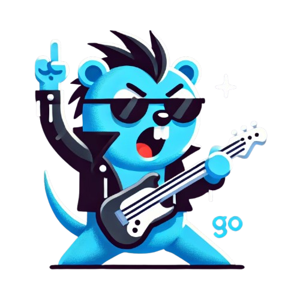

# gorock

🌍 *[English](README.md) ∙ [Russian](README_ru.md)* 

[//]: # ([![Build Status]&#40;https://github.com/swaggo/swag/actions/workflows/ci.yml/badge.svg?branch=master&#41;]&#40;https://github.com/features/actions&#41;)
[//]: # ([![Coverage Status]&#40;https://img.shields.io/codecov/c/github/swaggo/swag/master.svg&#41;]&#40;https://codecov.io/gh/swaggo/swag&#41;)
[//]: # ([![Go Report Card]&#40;https://goreportcard.com/badge/github.com/swaggo/swag&#41;]&#40;https://goreportcard.com/report/github.com/swaggo/swag&#41;)
[//]: # ([![codebeat badge]&#40;https://codebeat.co/badges/71e2f5e5-9e6b-405d-baf9-7cc8b5037330&#41;]&#40;https://codebeat.co/projects/github-com-swaggo-swag-master&#41;)
[//]: # ([![Go Doc]&#40;https://godoc.org/github.com/swaggo/swagg?status.svg&#41;]&#40;https://godoc.org/github.com/swaggo/swag&#41;)
[//]: # ([![Backers on Open Collective]&#40;https://opencollective.com/swag/backers/badge.svg&#41;]&#40;#backers&#41;)
[//]: # ([![Sponsors on Open Collective]&#40;https://opencollective.com/swag/sponsors/badge.svg&#41;]&#40;#sponsors&#41; [![FOSSA Status]&#40;https://app.fossa.io/api/projects/git%2Bgithub.com%2Fswaggo%2Fswag.svg?type=shield&#41;]&#40;https://app.fossa.io/projects/git%2Bgithub.com%2Fswaggo%2Fswag?ref=badge_shield&#41;)
[//]: # ([![Release]&#40;https://img.shields.io/github/release/swaggo/swag.svg?style=flat-square&#41;]&#40;https://github.com/swaggo/swag/releases&#41;)
Иконка 
Иконка 
Иконка 
Иконка 
Иконка 
 
Gorock - фреймворк-инструментарий для автоматизации рутинных задач в работе golang-developer
